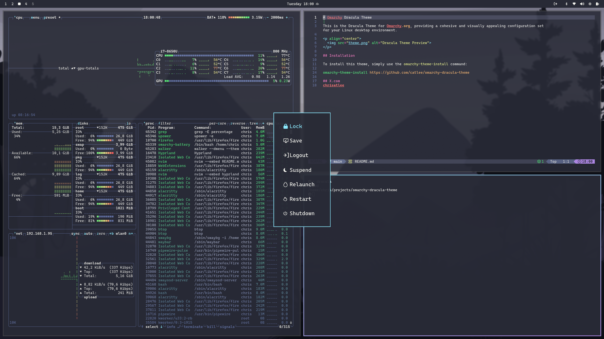

# Omarchy Dracula Theme

This is the Dracula Theme for [Omarchy.org](https://omarchy.org), providing a cohesive and visually appealing configuration set for your Linux desktop environment.

<p align="center">
  
</p>

## Installation

To install this theme, simply use the `omarchy-theme-install` command:

```bash
omarchy-theme-install https://github.com/catlee/omarchy-dracula-theme
```

## Unlock Screen

Dracula appears in **Style > Unlock** after installation. To apply it automatically whenever the Dracula desktop theme is selected, install the included hook:

```bash
omarchy hook install theme-set ~/.config/omarchy/themes/dracula/extras/dracula-unlock.hook
```

The hook opens a terminal for administrator authentication only when the unlock screen needs updating.

## Files

The theme selects purple Yaru folder icons automatically. To apply the Dracula surfaces to GTK 4 apps such as Files:

```bash
mkdir -p ~/.config/gtk-4.0
ln -s ~/.local/state/omarchy/current/theme/gtk.css ~/.config/gtk-4.0/gtk.css
nautilus -q
```

The link command safely refuses to replace an existing GTK stylesheet.

## X.com
[chrisatlee](https://x.com/chrisatlee)
